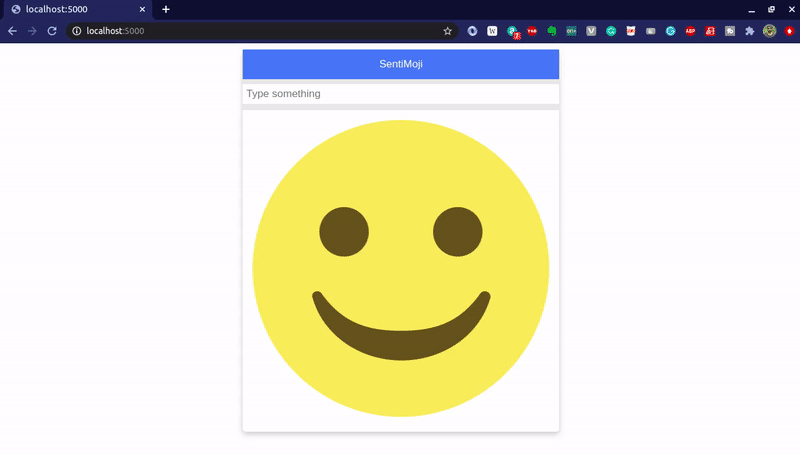

# SentiMoji

:star: Star me on GitHub — it helps!

# Welcome to SentiMoji!

This is a webapp that lets user enter a text and get back feedback in the form of emoji. The app show only two kinds of emotion - sad, when the text is negative and happy, when the text is positive!
