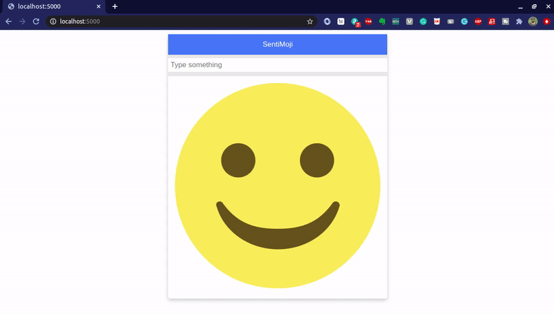

# SentiMoji 😊☹️

:star: Star me on GitHub — it helps!

[](https://github.com/ioarun/sentimoji/commits/main)
[](https://www.linkedin.com/in/ioarun/)
[](http://badges.mit-license.org)

## Hi! 👋 welcome to SentiMoji!

This is a webapp that lets user enter a text and get back feedback in the form of emoji. The app show only two kinds of emotion - sad, when the text is negative and happy, when the text is positive!

## Software stack

<p float="left">


</p>

<p align="center">

</p>

## Dependencies

* Python3
* Pip

**Note -** This package was created and tested on a `Ubuntu 18.04` machine. This shouldn't stop you from experimenting on your machine. It should work in most of the cases. If not, please feel free to raise an issue or reach out to me.

## Installation

1. Clone this repository.

```
$ git clone https://github.com/ioarun/sentimoji.git
```

2. Install
```
$ cd sentimoji/
$ pip install -r requirements.txt
```

## Usage

```
$ python main.py
```

## License

[](http://badges.mit-license.org)

## Questions?

You can reach out to me at [](mailto:arun.etc.kumar@gmail.com)